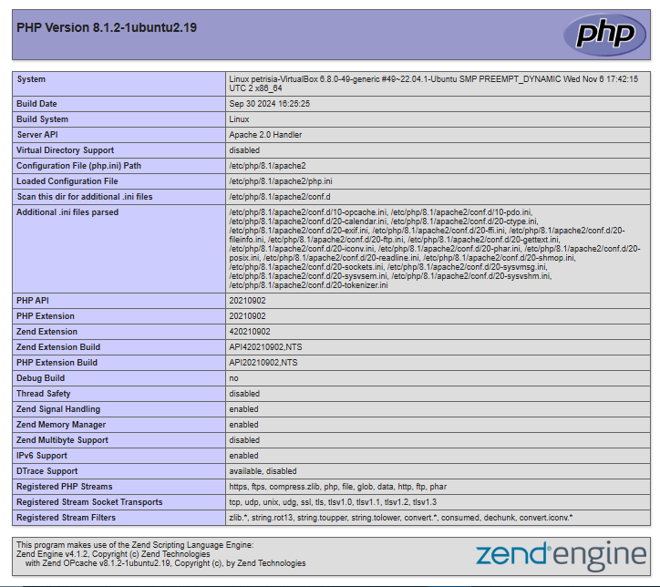

# FINAL PROJECT OS SERVER - 23.83.0978

Membuat Layanan Web Server di **Ubuntu Desktop 22.04.3** dengan spesifikasi berikut:
- **RAM**: 2 GB  
- **Processor**: 2 CPU  
- **Disk**: 32 GB

## Daftar Isi
1. [1. Web Server (Apache)](#1-web-server-apache)
2. [2. PHP](#2-php)
3. [3. MYSQL](#3-mysql)
4. [4. SSH Server](#4-ssh-server)
5. [5. FTP Server (vsftpd)](#5-ftp-server-vsftpd)
   

---

## 1. Web Server (Apache)
Penjelasan tentang instalasi dan konfigurasi Web Server (Apache).
### 1.1 Install Apache
Langkah 1: Install Apache
```
sudo apt install apache2 -y
```
### 1.2 Konfigurasi Apache
Langkah 2: Periksa status Apache
```
sudo systemctl status apache2
```
Langkah 3: Izinkan port 80 
```
sudo ufw allow 80/tcp
```
Langkah 4: Buka browser dan akses 
```
https://server-ip-address
```

## 2. PHP
Penjelasan tentang instalasi PHP
### 1.2 Install PHP
Langkah 1: Install php
```
sudo apt install php
```
Langkah 2: Menjalankan Skrip php di apache
```
sudo apt install libapache2-mod-php -y
```
Langkah 3: Cek Instalasi php

```
sudo nano /var/wwww/html/
```
Langkah 4: Tambahkan php
```
<?php
phpinfo();
?>
```
Langkah 5: Cek Akses
```
http:///<IP-Server>/info.php
```
## 3 MYSQL (DATABASE SERVER)
Penjelasan tentang instalasi MYSQL.
### 1.2 Install MYSQL
Langkah 1: Install MSQL
```
sudo apt install mysql-server -y
```
Langkah 2: Meningkatkan keamanan database
```
sudo mysql_secure_installation
```
Langkah 3: Buat Database Masuk ke MySQL
```
sudo mysql -u root -p
CREATE DATABASE Healthy_Food;
CREATE USER 'webuser'@'localhost' IDENTIFIED BY 'password';
GRANT ALL PRIVILEGES ON Healthy_Food.* TO 'webuser'@'localhost';
FLUSH PRIVILEGES;
```


## 4 Install Openssh-server(Remote Access)
Penjelasan tentang instalasi Openssh
### 1.1 Install Openssh
Langkah 1: Install Openssh
```
sudo apt install openssh-server -y
```
Cek Status SSH
```
sudo systemctl status ssh
```


## 5 Instal FTP Server (Transfer File)
Penjelasan tentang instalasi ftp
### 1.1 Install FTP Server
Langkah 1: Install ftp
```
sudo apt install vsftpd -y

```
### 1.2 Konfigurasi FTP
Langkah 2: Edit file konfigurasi
```
sudo nano /etc/vsftpd.conf
write_enable=YES
local_enable=YES
```
Restart layanan:
```
sudo systemctl restart vsftpd
```


#2. Buat Konten Website
## Atur file dan folder website di /var/www/html/
```
/var/www/html/
|-- index.html
|-- style.css
|-- script.js
|-- images/

```
 ## Tambahkan File HTML
```
 sudo nano /var/www/html/index.html
```
```

<!DOCTYPE html>
<html lang="en">
<head>
    <meta charset="UTF-8">
    <meta name="viewport" content="width=device-width, initial-scale=1.0">
    <meta name="description" content="Healthy Food - Your source for nutritious recipes and lifestyle tips">
    <title>Healthy Food</title>
    <!-- Bootstrap CSS -->
    <link rel="stylesheet" href="https://cdn.jsdelivr.net/npm/bootstrap@5.3.1/dist/css/bootstrap.min.css">
    <!-- Custom CSS -->
    <link rel="stylesheet" href="style.css">
</head>
<body>
    <!-- Navbar -->
    <nav class="navbar navbar-expand-lg navbar-light bg-light">
        <div class="container">
            <a class="navbar-brand animate__fadeInDown" href="#">Healthy Food</a>
            <button class="navbar-toggler" type="button" data-bs-toggle="collapse" data-bs-target="#navbarNav">
                <span class="navbar-toggler-icon"></span>
            </button>
            <div class="collapse navbar-collapse" id="navbarNav">
                <ul class="navbar-nav ms-auto">
                    <li class="nav-item"><a class="nav-link" href="#about">About</a></li>
                    <li class="nav-item"><a class="nav-link" href="#recipes">Recipes</a></li>
                    <li class="nav-item"><a class="nav-link" href="#contact">Contact</a></li>
                </ul>
            </div>
        </div>
    </nav>

    <!-- Hero Section -->
    <header class="bg-success text-white text-center py-5 animate_animated animate_fadeIn">
        <div class="container">
            <h1 class="display-4">Welcome to Healthy Food</h1>
            <p>Your go-to platform for a healthier lifestyle!</p>
        </div>
    </header>

    <!-- About Section -->
    <section id="about" class="py-5">
        <div class="container text-center">
            <h2 class="animate_animated animate_fadeInUp">About Us</h2>
            <p class="animate_animated animatefadeInUp animate_delay-1s">
                Healthy Food is dedicated to helping you live a healthier, happier life through balanced meals, recipes, and wellness tips.
            </p>
        </div>
    </section>

    <!-- Recipes Section -->
    <section id="recipes" class="py-5 bg-light">
        <div class="container">
            <h2 class="text-center animate_animated animate_fadeInUp">Healthy Recipes</h2>
            <div class="row">
                <div class="col-md-4">
                    <div class="card animate_animated animate_zoomIn">
                        
                        <div class="card-body">
                            <h5 class="card-title">Fresh Salad</h5>
                            <p class="card-text">A refreshing and nutritious mix of greens, veggies, and dressing.</p>
                        </div>
                    </div>
                </div>
                <div class="col-md-4">
                    <div class="card animate_animated animatezoomIn animate_delay-1s">
                        
                        <div class="card-body">
                            <h5 class="card-title">Fruit Smoothie</h5>
                            <p class="card-text">Blended fruits for a delicious and energy-packed drink.</p>
                        </div>
                    </div>
                </div>
                <div class="col-md-4">
                    <div class="card animate_animated animatezoomIn animate_delay-2s">
                        
                        <div class="card-body">
                            <h5 class="card-title">Healthy Bowl</h5>
                            <p class="card-text">A perfect combination of grains, veggies, and protein.</p>
                        </div>
                    </div>
                </div>
            </div>
        </div>
    </section>

    <!-- Contact Section -->
    <section id="contact" class="py-5">
        <div class="container text-center">
            <h2 class="animate_animated animate_fadeIn">Contact Us</h2>
            <p class="animate_animated animatefadeIn animate_delay-1s">
                Email us at: <a href="mailto:info@healthyfood.com">info@healthyfood.com</a>
            </p>
        </div>
    </section>

    <!-- Footer -->
    <footer class="bg-dark text-white text-center py-3 animate_animated animate_fadeInUp">
        <p>&copy; 2024 Healthy Food. All rights reserved.</p>
    </footer>

    <!-- Bootstrap JS -->
    <script src="https://cdn.jsdelivr.net/npm/bootstrap@5.3.1/dist/js/bootstrap.bundle.min.js"></script>
</body>
</html>
<!-- Tambahkan di bagian akhir file HTML -->
<script>
    // 1. Animasi Scroll dengan Intersection Observer
    const animateOnScroll = () => {
        const elements = document.querySelectorAll('.animate-on-scroll');
        const observer = new IntersectionObserver((entries) => {
            entries.forEach((entry) => {
                if (entry.isIntersecting) {
                    entry.target.classList.add('animate_animated', 'animate_fadeInUp');
                }
            });
        });

        elements.forEach((el) => observer.observe(el));
    };

    // 2. Efek Klik Warna-Warni pada Tombol
    const colorfulButtonEffect = () => {
        const buttons = document.querySelectorAll('button');
        buttons.forEach((button) => {
            button.addEventListener('click', () => {
                const colors = ['#FF5733', '#33FF57', '#3357FF', '#F3FF33', '#FF33D4'];
                const randomColor = colors[Math.floor(Math.random() * colors.length)];
                button.style.backgroundColor = randomColor;
                button.style.color = '#fff';
                setTimeout(() => {
                    button.style.backgroundColor = '';
                    button.style.color = '';
                }, 500);
            });
        });
    };

    // 3. Perubahan Background Warna Secara Dinamis
    const dynamicBackground = () => {
        const colors = ['#FFEDD5', '#D5FFF5', '#FFD5ED', '#E3FFD5', '#D5E3FF'];
        let currentIndex = 0;

        setInterval(() => {
            document.body.style.backgroundColor = colors[currentIndex];
            currentIndex = (currentIndex + 1) % colors.length;
        }, 3000); // Ganti warna setiap 3 detik
    };

    // 4. Efek Hover pada Gambar (Menambahkan Filter)
    const hoverEffectOnImages = () => {
        const images = document.querySelectorAll('img');
        images.forEach((img) => {
            img.addEventListener('mouseover', () => {
                img.style.filter = 'brightness(1.2) contrast(1.2)';
                img.style.transition = 'all 0.5s ease-in-out';
            });
            img.addEventListener('mouseout', () => {
                img.style.filter = '';
            });
        });
    };

    // 5. Menjalankan Semua Fungsi saat Halaman Dimuat
    document.addEventListener('DOMContentLoaded', () => {
        animateOnScroll();
        colorfulButtonEffect();
        dynamicBackground();
        hoverEffectOnImages();
    });
</script>

```

## Tambahkan Style (CSS)
```
sudo nano /var/www/html/style.css
```
```
/* Custom Styles */
body {
    font-family: Arial, sans-serif;
    line-height: 1.6;
}

header {
    background: url('images/healthy-bg.jpg') no-repeat center center/cover;
    height: 300px;
    color: white;
    text-shadow: 2px 2px 5px rgba(0, 0, 0, 0.7);
    animation: fadeIn ease-in-out 2s;
}

h1, h2 {
    font-family: 'Georgia', serif;
}

.card img {
    height: 200px;
    object-fit: cover;
    transition: transform 0.3s ease-in-out;
}

.card:hover img {
    transform: scale(1.1);
}

.card {
    transition: box-shadow 0.3s ease-in-out;
}

.card:hover {
    box-shadow: 0 8px 20px rgba(0, 0, 0, 0.2);
}

footer {
    background-color: #333;
}

/* Animation Keyframes */
@keyframes fadeIn {
    from {
        opacity: 0;
    }
    to {
        opacity: 1;
    }
}

```


 
